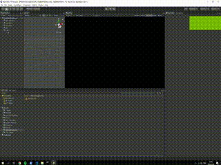
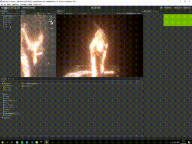

# Depthkit-VFX-Template

## Overview

    This project is pulled from Keijiro's dkvfx repo.  It serves as a template for future Depthkit-VFX projects.

### Setting up Depthkit Video

We need to start by converting the Depthkit video to a hap-alpha format.  I use the `ffmpeg` library with the Windows sub-system for Linux. 

To convert the video file open a command prompt at the directory of the Depthkit video and type the following command:

    ffmpeg -i yourSourceFile.mp4 -c:v hap -format hap_alpha outputName.mov

### Importing Depthkit Video

Open the `DepthkitVfxDemo` scene in `Assets/Scenes/`. Import the 3 files for the depthkit video.  Place the *video* only in the `Assets/StreamingAssets/` directory.  Place the other two files in the `Assets/Depthkit Metadata/` directory.  

### Creating the Metadata file

Convert the `.txt` file into a `Metadata` file by right clicking on the `.txt` and select `Depthkit/ConvertToMetadata`. You can delete the `.txt` if you wish.  

## Scene Setup

### Hap Player

Select the `Hap Player` object in the hierarchy.  Type in the name of the video file in the `File Path` section to use that video in the VFX Graph.

You can adjust the speed of the video playback with the `Speed` variable on the `Hap Player` component.

### Converter

Select the `Converter` object in the hierarchy.  Change the `Metadata` field to use the correct Metadata file (the one that correlates with the video you indicated in the `Hap Player` component)

### Vfx

Select the `Vfx` object in the hierarchy.  Select the `vfx asset` you want to use.  Click the `Edit` button to open that particle system in the VFX graph window.

To create your own `vfx asset`, right click in the Project window and select `Create/VisualEffects/VisualEffectGraph`.

    Play with the Depth Threshold variable on the Visual Effect component to see what gives the best results.  It essentially clamps the depth that will be visible by the VFX graph.

Now go create some beautiful effects :)
